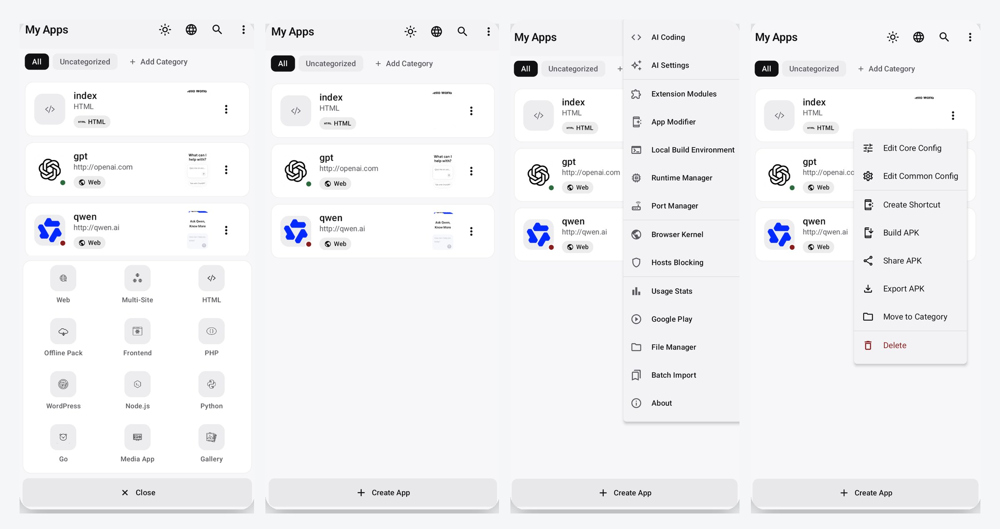

<div align="center">


# WebToApp

### 在手机上把 Web 项目打包成可安装的 Android APK。

**一个运行在设备端的 APK 工作台,远不只是套个 WebView —— 它能在手机上 fork+exec 完整的服务端运行时,内置硬核反审查网络栈,能在设备内签名上架 Google Play 的 AAB,还能跑 MV3 浏览器扩展,全程不需要电脑或远程构建服务器。**

[English](../../README.md) · **简体中文**

[](https://github.com/shiaho777/web-to-app/stargazers)
[](https://github.com/shiaho777/web-to-app/network/members)
[](../../LICENSE)
[](#)

</div>

<p align="center">
  <a href="#webtoapp-有什么不同">有什么不同</a> ·
  <a href="#能力速览">能力速览</a> ·
  <a href="#能打包什么">能打包什么</a> ·
  <a href="#完整能力地图">完整能力地图</a> ·
  <a href="#模块市场">模块市场</a> ·
  <a href="#架构说明">架构说明</a> ·
  <a href="#从源码构建">构建</a>
</p>

---

<div align="center">

</div>

---

## WebToApp 有什么不同

绝大多数「网站转 App」工具到「套一个 WebView」就结束了。WebToApp 更像一个放在手机里的 APK 工作台,而真正难的地方,正是它和那些工具的分界线:

- **在设备上跑真实的服务端运行时。** Node.js、PHP、Python、Go、WordPress 以原生二进制的形式直接从 app 存储 fork+exec —— 像 Termux 那样,但被打进一个可安装的 APK。URL 套壳工具根本做不到。
- **内置硬核、反审查的网络栈。** DNS-over-HTTPS、TLS 指纹伪装(Chrome / Firefox / Safari 的 JA3 模板,经本地 MITM 桥接)、GeckoView 引擎上的 ECH(加密 SNI)、每应用代理、以及针对受限 SPA 的 CORS 绕过。
- **整个构建自包含。** 二进制 AXML/ARSC 修补、权限裁剪、V1/V2/V3 签名、可直接上架 Google Play 的 AAB 导出,全部在 app 内通过 `apksig` 完成 —— 不排远程队列、不需要电脑。
- **发布后仍可扩展。** 通过 JS/CSS 模块、Tampermonkey 风格油猴脚本,或 MV3 Chrome 扩展(可在应用内实时搜索 Chrome 网上应用店并安装)给应用补能力,不必重新发布宿主。
- **宿主 UI 原生支持 10 种语言。** 中文、English、العربية(RTL)、Português、Español、Français、Deutsch、Русский、日本語、한국어 —— 设置里随时切换;新增界面文案按 10 语维护。

---

## 能力速览

一眼看清里面有什么。每项都对应下方完整能力地图。

| 方向 | 亮点 |
| --- | --- |
| **构建目标** | Web · HTML · 前端 · WordPress · Node.js · PHP · Python · Go · 图片 · 视频 · 图库 · 多网站 |
| **浏览器引擎** | 默认系统 WebView;可选 GeckoView(Firefox)运行时,用于 ECH / SNI 加密 |
| **网络与反审查** | DoH(7 个服务商)、TLS 指纹伪装 + MITM 桥、ECH、静态/PAC/SOCKS5 代理、CORS 绕过 |
| **隐私与加固** | 50+ 维浏览器指纹伪装、资源加密(AES-256-GCM)、反调试、激活码门控 |
| **本地运行时** | 原生 Node.js 18.20、PHP 8.4 + Composer 2.10、Python 3.14、官方 Go 1.26、WordPress 7.x over SQLite |
| **扩展能力** | 内置模块、`GM_*` 油猴脚本、MV3 Chrome 扩展、Chrome 网上应用店实时搜索 |
| **APK/AAB 产物** | 设备端 V1/V2/V3 签名、**增量重打包**(复用未签名包 / 内容覆盖)、Google Play AAB 导出(自动改写 targetSdk)、密钥库管理 |
| **AI 编程** | 通过 prompt 生成网页、扩展模块、油猴脚本和本地运行时项目;429/5xx 自动重试 |
| **宿主语言** | **10 种界面语言** —— 中文 · English · العربية · Português · Español · Français · Deutsch · Русский · 日本語 · 한국어(阿语 RTL) |
| **通知推送** | Web Notification polyfill · URL 轮询 · WebSocket 推送 · FCM(自备 Firebase) · 深链 · 开机恢复 |

---

## 能打包什么

| 输入 | 输出 | 适合场景 |
| --- | --- | --- |
| 网站 URL | 基于 WebView 的 APK | 官网、工具、后台、文档、内部系统 |
| HTML / 静态前端 | 走 localhost 的 APK | React、Vue、Vite、静态构建、离线 Web 应用 |
| Node.js / PHP / Python / Go | 带设备端本地服务的 APK | 小型服务端应用、管理工具、演示、原型 |
| WordPress | 本地 PHP + SQLite 承载的 APK | 便携站点、主题/插件演示、本地内容包 |
| 图片 / 视频 / 图库 | 媒体型 APK | 相册、课程材料、作品集、离线浏览 |
| 多个网站 | 标签/卡片/信息流/抽屉布局 APK | 导航合集、门户、应用集合 |
| 已安装 APK | 重命名克隆或桌面快捷方式伪装 | 图标/名称/包名实验、APK 重打包研究 |

---

## 完整能力地图

WebToApp 的开关非常多。下面按使用场景分组,并用可折叠区段保持页面顶部清爽可读。

<details>
<summary><b>🌐 浏览器引擎与网络</b></summary>

- **双引擎** —— 默认系统 WebView,可选 GeckoView(Firefox)运行时(首次使用时下载)。
- **内核风味伪装** —— 对外表现为 Chrome、Edge、Samsung Internet、Firefox 或 Safari 风格,但真实引擎不变。
- **桌面模式**、自定义 User-Agent,以及 document-start / end / idle 三种时机的 JS/CSS 注入。
- **弹窗处理** —— 当前窗口、外部浏览器、弹窗窗口或直接拦截。
- **代理** —— 静态 HTTP/HTTPS/SOCKS5、PAC、身份验证、绕过规则和本地 HTTP-to-SOCKS 桥。
- **DNS-over-HTTPS** —— Cloudflare、Google、AdGuard、NextDNS、CleanBrowsing、Quad9、Mullvad,以及自定义 endpoint;支持 strict / automatic 模式。
- **ECH(Encrypted Client Hello)** —— 加密 TLS 握手中的 SNI(仅 GeckoView;开关启用时自动联动 DoH + GeckoView)。
- **TLS 指纹伪装** —— 模拟 Chrome 131 / Firefox 133 / Safari 18 的 JA3 指纹(或自定义密码套件),经本地 TLS-MITM 桥接,让发出的 ClientHello 与真实浏览器一致。
- **CORS 绕过** —— 默认开启,让受限静态 SPA 能调用原本被 CORS 拦截的外部 API;同源请求不会被误拦,仅需 CORS/内网桥接时可用轻量 `PrivateNetworkNativeBridgeAdapter`,不必挂完整 Native Bridge。
- **回退链** —— 主目标不可达时自动回退到镜像 URL。
- **PWA** 离线缓存策略、自定义错误页、每应用 hosts 覆写和支付协议处理。
- **兼容开关** —— blob 下载拦截、滚动记忆、图片修复、剪贴板 / 方向 / 通知 polyfill、内网桥接和 Native Bridge 能力门控。
- **下载位置** —— 系统 Downloads、应用私有目录,或用户用 SAF 自选文件夹,整条打包透传链已接通。

</details>

<details>
<summary><b>🛡️ 隐私、指纹防御与加固</b></summary>

- **跨 50+ 维的浏览器指纹伪装** —— User-Agent、WebGL、Canvas、AudioContext、ClientRects、时区、语言、内存、媒体设备、WebRTC、字体、电池、权限、性能、存储、通知、CSS media、iframe 传播和错误栈清理。
- **hosts 规则广告拦截** + cosmetic MutationObserver 过滤,**内置 20 个社区过滤源**(EasyList、uBlock Origin、AdGuard、AdAway + 8 个语言列表),支持逐源启用/停用/删除,以及打包进 APK 的自定义订阅规则。
- **资源加密**(PBKDF2 + AES-256-GCM)覆盖打包进去的配置、HTML、媒体和 BGM;可设置自定义加密密码,比默认的包名/证书派生密钥更能抵御逆向提取。
- **运行时加固**(开启加密后可用)—— 反调试、反 Frida、DEX 篡改检测;威胁响应可选只记录、静默退出或随机崩溃。
- **WebView/内容隔离**覆盖存储、WebRTC、Canvas、Audio、WebGL、字体、请求头和 IP 暴露面。
- **激活码门控** —— 本地验证,或接入你自己的 HTTPS 接口并用 EC P-256 验签。接口契约见 [remote activation 文档](remote-activation.md)。

</details>

<details>
<summary><b>📦 设备端服务器运行时(fork + exec)</b></summary>

- **Node.js**(18.20.x)跑在独立 `:nodejs` OS 进程中,底层由原生 `node_launcher` 加载 `libnode.so`;支持自定义原生 `.node` 扩展。
- **PHP 8.4** 取自 `pmmp/PHP-Binaries`,首次使用时下载,支持 Composer 2.10.x 和自定义原生扩展(`zend_extension`、`.so`)。
- **Python 3.14** —— Flask、Django、FastAPI/uvicorn、Tornado、内置 HTTP server;pip 依赖解析到 `.pypackages`,支持自定义原生扩展;二进制名按版本生成,后续升级不必硬编码路径。
- **Go 1.26** —— 官方 Linux arm64 工具链(`.tar.gz` 来自 `dl.google.com`,国内走 USTC 镜像),设备端 `go build` / `go mod` / `go run`、`vendor/` 离线构建、静态文件服务和原生 `go_exec_loader` 包装层;DNS 与 CA 信任走与 PHP 相同的本机 JVM 桥接。
- **WordPress 7.x** 跑在本地 PHP 之上,用 `sqlite-database-integration` 接 SQLite,支持主题和插件导入。
- **Linux Environment** 页面管理 Node、PHP、Python 的工具链和依赖。
- **Port Manager** 协调宿主预览与生成应用的运行时端口 —— 冲突策略(重分配 / 自动结束占用 / 告警)、真实 stop handler 与进程跟踪,避免本地服务悬空占用。
- **本地 DNS 桥接代理**(运行在 Android JVM 的 HTTP CONNECT)在 musl/打包二进制无法访问系统 DNS 时,为运行时提供可用的 DNS 解析和出站 HTTP。

</details>

<details>
<summary><b>🧩 扩展与自动化</b></summary>

- **内置模块** —— 视频下载(YouTube / B 站 / 抖音 / 小红书提取器)、带 YouTube 净化(跳过广告、最高画质、后台播放、SponsorBlock)的视频增强、网页分析、页内查找、暗色模式、隐私工具、内容增强、元素拦截和 YouTube 启动器。
- **油猴脚本** —— Greasemonkey/Tampermonkey 风格的 `.user.js`,配套 `GM_*` 桥接(存储、请求、样式、菜单命令)和按授权开放的 Promise 风格 `GM.*` API。
- **MV3 Chrome 扩展运行时**,支持 manifest 内容脚本在 isolated 或 main world 注入,并提供覆盖 runtime、storage、tabs、scripting 和 declarative network request 解析的 `chrome.*` polyfill。
- **应用内 Chrome 网上应用店搜索** —— 按关键词浏览并安装浏览器扩展(也可粘贴商店链接 / 扩展 ID),离线时回退到手动导入。
- **分享码**(`WTA1:` gzip + Base64)和 ZXing 二维码传播。
- **AI Coding** skill 可生成扩展模块、油猴脚本、MV3 扩展、前端应用和本地运行时项目;对 429/5xx 自动退避重试,计划模式退出会真正停住等待用户确认。

</details>

<details>
<summary><b>📱 应用体验</b></summary>

- **启动屏** —— 图片或视频,支持跳过、视频裁剪区间和固定方向。
- **背景音乐** —— 播放列表 + LRC 同步歌词、歌词动画、自定义字体/颜色/描边/阴影和在线音乐搜索。
- **工具栏、状态栏(亮色/暗色)、导航栏、悬浮窗模式和长按菜单样式。** 状态栏颜色可跟随主题、自定义色、全透明,或 **PAGE_TOP**(采样页面顶部像素,让系统栏跟内容同色)。
- **下载位置模式** —— 系统 Downloads、应用私有目录,或用户用 SAF 自选文件夹。
- **公告模板**,可在启动、定时或无网络时触发。
- **宿主应用语言** —— 整个打包器界面可在 10 种语言间切换(中文 / English / العربية / Português / Español / Français / Deutsch / Русский / 日本語 / 한국어);阿拉伯语完整 RTL。
- **页内翻译覆盖层** —— 20 种目标语言,支持 Google、MyMemory、LibreTranslate、Lingva 或 Auto 引擎(给*生成应用内容*做页内翻译,与宿主 UI 语言是两套能力)。
- **打印桥接** —— 拦截 `window.print()` 和 blob/data-URL 的 PDF,交给 Android 打印框架 / 导出 PDF(onPageStarted 会再注入一次,避免晚导航丢 hook)。
- **通知** —— Web Notification polyfill、URL 轮询与 **WebSocket** 推送通道、**FCM**(自带 Firebase 项目 / 可选粘贴 `google-services.json`)、定时与持久化通知(含进度更新)、可选 Token 注册回调、深链、开机/更新后恢复、定时启动和后台运行服务。不内置厂商推送 SDK；无 GMS 环境可用自建 WebSocket 通道。
- **每个 APK 的使用统计**、Vico 图表和 URL 健康监测。

</details>

<details>
<summary><b>🔧 APK / AAB 导出与签名</b></summary>

- **自定义包名**、`versionName`、`versionCode`、图标、名称、架构目标和导出格式。
- **按生成 APK 的实际勾选注入权限**,并从模板 manifest 中裁剪未使用权限。
- **增量 APK 重打包** —— 按应用缓存上一份**未签名**基座(`filesDir/apk_build_cache/`)。身份与内容都未变 → 仅签名复用;仅内容变 → 内容增量覆盖(不重走整壳模板展开);包名/图标/引擎/加密/模板变化(或勾选**强制完整构建**) → 全量打包。开启资源加密时始终全量。这是导出侧的中间产物缓存,**不是**去检测手机上已安装的 APK。
- **一键 AAB 导出** —— 按需自动构建 APK,转换成可直接上架的签名 AAB(自动把 `targetSdk` 改写到 Play 要求的级别,目前为 35,并在本地生成 protobuf 元数据);支持中途取消。AAB 路径目前仍走完整 APK 构建。
- **密钥库管理** —— 创建、导入、导出、删除和证书指纹查看;支持 PKCS12/PFX/JKS/BKS 导入,包括 Android Studio upload key 那种 store 密码和 key 密码不同的情况。
- **签名方案** —— V1、V2、V3 独立控制,可对旧证书兼容性自动回退;自定义 V1 签名文件名,对应 `META-INF/<name>.SF` / `.RSA`。
- **性能选项** —— 图片压缩、WebP 转换、代码压缩、懒加载、DNS 预取、preload 提示。
- **完整项目备份/恢复和应用数据备份/恢复。**

</details>

<details>
<summary><b>🗂 文件管理与项目工具</b></summary>

- **文件管理** —— 一个界面统一查看、分享、安装、打开和清空构建产物(APK 构建、AAB 导出、应用克隆、构建日志)和用户文件目录,并提供只读的构建日志查看器。
- **网站爬虫**用于生成离线包 —— HTML、CSS、JS、图片、字体、`url()`、`srcset`、`@import`、路径重写、同域限制、深度限制和体积限制;并行流式 worker 池,进度回调回到主线程。
- **多网站应用** —— 标签、卡片、信息流、抽屉布局,每站点独立图标/主题色/提取选择器/刷新间隔和共享 JS/CSS。
- **图库应用** —— 媒体分类、网格/列表/时间线视图、随机/单循、排序、缩略图条、浮层、视频自动下一个和播放记忆。
- **应用修改器** —— 桌面快捷方式伪装,或真正的二进制克隆、manifest/资源修补和重签名。

</details>

<details>
<summary><b>🔬 专项工具与研究功能</b></summary>

- **强制运行**、**BlackTech**、**设备伪装**、**图标风暴**属于技术演示能力,必须在用户知情同意下使用。

</details>

---

## 模块市场

WebToApp 有一个由 GitHub 驱动的模块市场,用来分发社区贡献的 JS/CSS 扩展模块。目录本质上就是这个仓库里的文件,所以贡献流程就是普通 PR。

```
modules/
├── registry.json        # App 读取的目录
├── submissions.json     # CI 生成的 PR / 贡献者元数据
├── README.md            # 贡献者指南
└── <模块文件夹>/         # 每个模块
```

App 会同时拉取 `registry.json` 和 `submissions.json`,只展示两边都存在的模块,保证应用内市场和已经合并的 PR 对齐。submissions 文件还会记录每个模块的全部贡献者,因此应用内会以叠加头像的形式展示所有参与过该模块的人,并按贡献模块数排出贡献者榜单。目录文件和模块图标会优先走全球镜像加速,raw.githubusercontent.com 和 jsDelivr 作为自动回退,因此商店在全球(含中国大陆)都能快速加载。

- 用户打开 **扩展模块** 页面,点击右上角商店图标即可安装。
- 贡献者在 `modules/` 下添加文件夹,更新 `registry.json`,然后提交 PR。
- 客户端默认缓存 1 小时,模块合并后不需要发新版 App。

这里保留的是模块市场的高层说明;真正的投稿规则、字段 schema、审核 Checklist 和 CI 校验细节统一写在 [`modules/README.md`](../../modules/README.md)。

社区市场只承载 JS/CSS 扩展模块。**浏览器扩展(MV3)**不再是社区目录 —— **浏览器扩展** Tab 直接实时搜索 Chrome 网上应用店:输入关键词、浏览结果、通过现有的 CRX 下载链路按需安装。如果实时搜索不可达,也可以粘贴商店链接或 32 位扩展 ID 直接安装。实时搜索需要能访问 Google 的网络。

## 架构说明

- 仓库有**三个 Gradle 模块**:`app`(完整构建器和宿主)、`shell`(嵌入生成 APK 的运行时宿主)、`clone-host`(应用克隆的宿主代码 —— 编译提取 `classes.jar`,经 d8 转 DEX,作为 asset 供 `AppCloner` 使用)。
- 运行时代码以 `app` 为唯一事实来源,再同步到 `shell`,所以共享 WebView/运行时行为只维护一份(`core/shell`、`core/webview`、`core/engine`、`core/extension`、`ui/shell` 等)。
- APK 构建器在二进制 AXML/ARSC 层修补模板 APK,注入配置与资源,裁剪权限,并用 `apksig` 签名。`ApkBuildCache` 缓存未签名基座以支持增量构建(`FULL` / `CONTENT_OVERLAY` / `REUSE_UNSIGNED`)。另有独立的加密构建路径(`EncryptedApkBuilder`)提供资源加密、加壳和完整性校验(加密构建始终跳过增量缓存)。
- 宿主把 `targetSdk = 28` 钉死 —— 这是让生成应用能从 app 存储 `fork`、`exec` 原生运行时(Node.js、PHP、Python、Go、WordPress)的关键,网址转 APK 类工具做不到这点;导出 AAB 时会单独把 `targetSdk` 改写以满足 Google Play 上架要求。
- 服务端运行时和可选 GeckoView 原生运行时不会打进基础 APK,而是在首次使用时下载。
- 配置中心是 `WebApp`(`data/model/WebApp.kt`)及其各 `*Config` 类 —— 所有功能配置的单一事实来源,经一条完整的打包透传链带进生成的 APK。

## 技术栈

- Kotlin、Jetpack Compose、Material 3
- Koin 依赖注入
- Room 2.7.2 + KSP 数据持久化
- OkHttp 4.12.0 + `okhttp-dnsoverhttps`
- `com.android.tools.build:apksig` 8.3.0 用于 APK 签名
- `protobuf-javalite` 3.25.5 用于 AAB 元数据
- GeckoView 作为可选浏览器引擎
- Coil 负责图片、视频、GIF 加载
- AndroidX Security Crypto + DataStore 存储密钥
- Vico Compose-M3 绘制图表
- ZXing 用于二维码分享
- Apache Commons Compress + xz 用于项目导入和网站爬虫
- JNI 原生 C++ 目标:`node_launcher` 和 `go_exec_loader`
- Robolectric 单元测试

完整依赖见 [app/build.gradle.kts](../../app/build.gradle.kts)。

## 从源码构建

要求:Android Studio Hedgehog 或更新版本,JDK 17。Gradle wrapper 已锁定 Gradle 9.4.1。

```bash
git clone https://github.com/shiaho777/web-to-app.git
cd web-to-app
./gradlew assembleDebug
```

Release 构建请通过 `local.properties` 和 `app/build.gradle.kts` 配置签名。

## 参与贡献

默认交付闭环：**Issue → 分支 → 向 `main` 提 PR → CI（`check` 绿）→ 合并**（Issue 用 `Fixes #N` 在合并后关闭，而不是开 PR 时关）。细节见 [CONTRIBUTING.md · Pull Request](../CONTRIBUTING.md#pull-request) 与 [AGENTS.md · Delivery](../../AGENTS.md#delivery-issue--pr--ci)。

| 路径 | 内容 | 指南 |
| --- | --- | --- |
| `modules/` | 给应用内市场提交一个社区模块 | [modules/README.md](../../modules/README.md) |
| Issues | 报告 Bug 或申请功能 | [GitHub Issues](https://github.com/shiaho777/web-to-app/issues) |
| 代码 | 修 Bug 或在 Android 客户端做新功能 | [CONTRIBUTING.md](../CONTRIBUTING.md) |
| Agents / AI 编程 | 用 coding agent 改本仓库（布局、LITE shell、导出 packs、常用工作流） | [AGENTS.md](../../AGENTS.md) |

## 联系方式

开发者:**shiaho**。

| 平台 | 链接 |
| --- | --- |
| GitHub | [github.com/shiaho777/web-to-app](https://github.com/shiaho777/web-to-app) |
| Telegram | [t.me/webtoapp777](https://t.me/webtoapp777) |
| X (Twitter) | [@shiaho777](https://x.com/shiaho777) |
| Bilibili | [b23.tv/8mGDo2N](https://b23.tv/8mGDo2N) |
| QQ 群 | 1041130206 |

## 许可证

[The Unlicense](../../LICENSE)。

强制运行、BlackTech、设备伪装、图标风暴等高级功能仅用于技术演示,必须在用户知情同意下使用。

<div align="center">

**开源 · 为 Android 高阶用户打造 · Star 一下支持项目**

</div>
